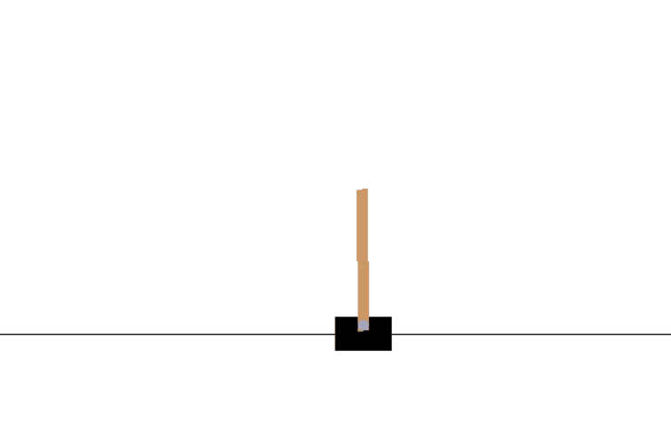
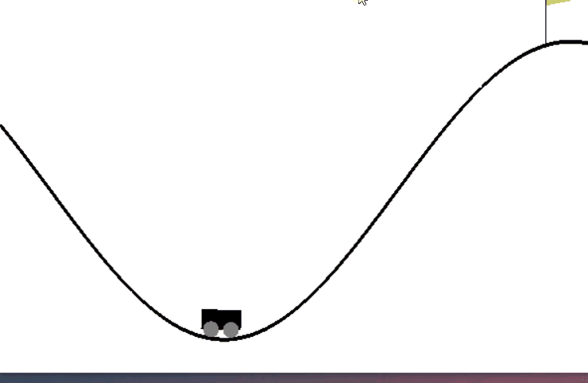

# Solving Reinforcement Learning Tasks with NEAT

## Presentation on NEAT
* [LINK](https://docs.google.com/presentation/d/1H4W0TBSQHH-FQ18fmvH-Qv1MRaqOpOf0MI1bV-UftOM/edit#slide=id.g1096e8bacce_0_164)

## Juypter Notebook for Demo
[Notebook](neat_demo.ipynb)

 Simply Run Winning Genomes in testing.py

## Pole Balancing

## Mountain Car Climbing

